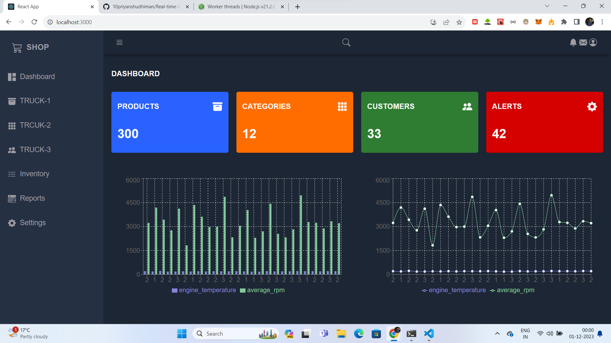
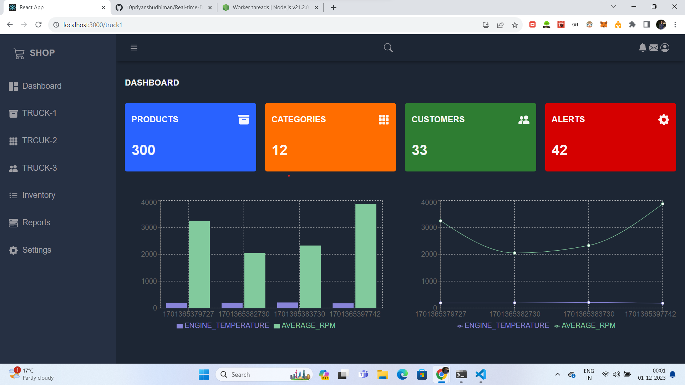
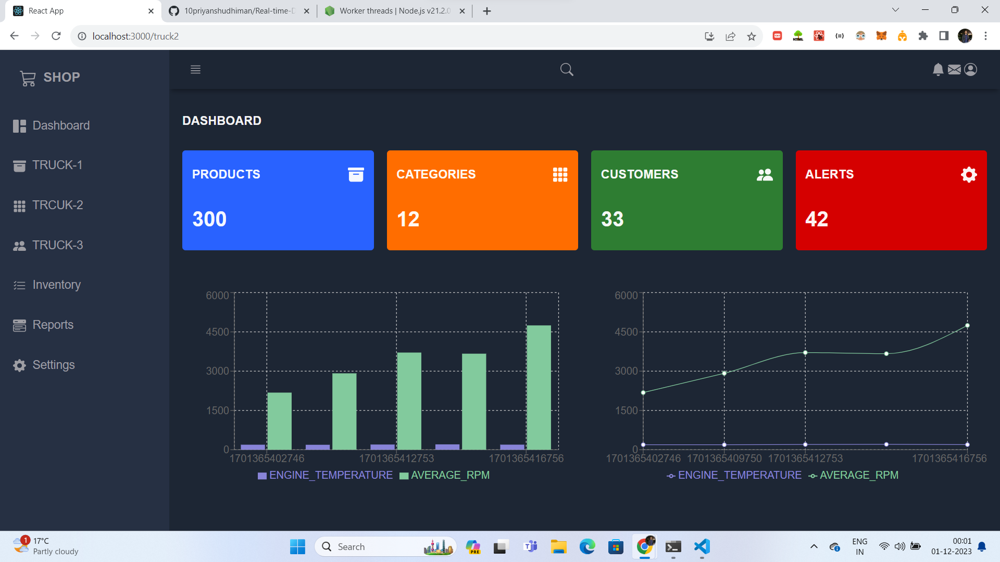
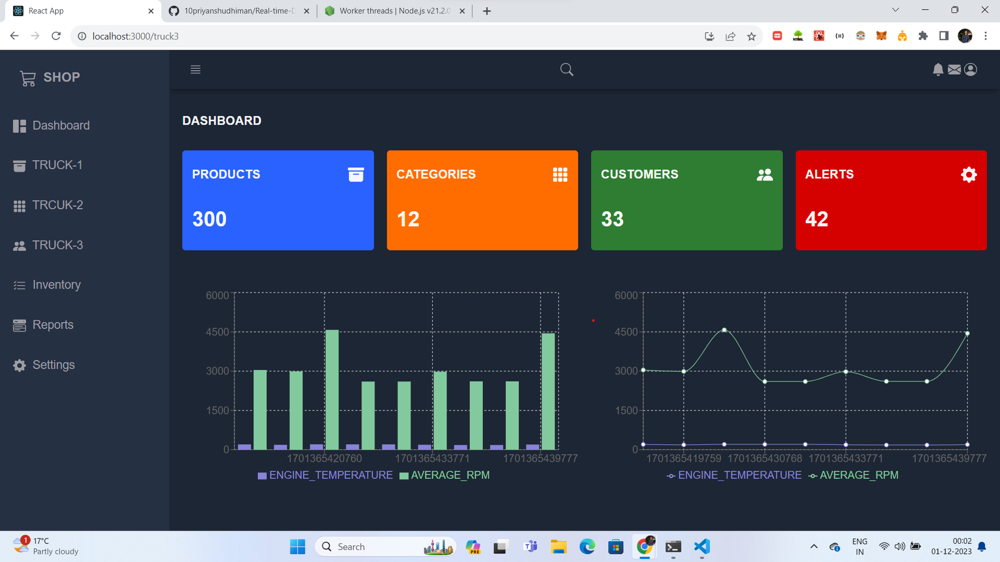

# Real-Time-Dashboard

<This Project is for Version 1 (V1) There can be changes in this code >
Here we are using Truck-Sensors Data where we are measuring the Truck data that comes to our kafka and show results to Dasboard

I am taking data from json file which we fed into consumer through script which will produce data to different topics
In this we are feding only one topic and others topics are derived from it using ksql streams see ksql folder of how we are making streams.

For server side i am using nodejs and socketIo to Perform realtime actions (For more details see Server Part below)
For Client side i am using reactjs to better Performance and speed (For more details see Client Part below)

The kafka Topics that we created are

```
"TRUCK-SENSORS",
"TRUCK-1-SENSORS",
"TRUCK-2-SENSORS",
"TRUCK-3-SENSORS",
```

# Running Locally

We're deploying the following components with Docker compose:

- Zookeeper
- Kafka
- Create Topics container
- ksqlDB server
- ksqlDB CLI

Also i have [ksqlDB Server config][ksqldb-server-config] to see how we're configuring the ksqlDB server in this Project.

To start with Project on any platform run the following command:

```sh
docker-compose up
```

Open another terminal and :-
Log into the ksqlDB CLI using the following command:

```sh
docker-compose exec ksqldb-cli ksql http://ksqldb-server:8088
```

If you see a `Could not connect to the server` error in the CLI, wait a few seconds and try again. ksqlDB can take several seconds to start.

Then, run this command in the ksqldb-cli:

```sql
SHOW TOPICS;
```

if you are on windows and not using wsl to run then you will see the following error:-
./create-topics.sh: line 2: $'\r': command not found
to resolve this either use this :-

```
dos2unix filename

```

or any other method you like

If you are unable to create topics then create manually but name should be exact for project to run

```
docker-compose exec kafka kafka-topics --bootstrap-server localhost:29092 --topic {NAME_AS_ABOVE} --create --partitions 1 --replication-factor 1
```

Now, you're ready to run the ksqlDB statements for our Project.

## 1 | Set the Ksql consumer to `earliest`

We want to set the Ksql consumer to `earliest` so that we can see all messages that we will be producing.
Run the following:

```sql
SET 'auto.offset.reset'='earliest';
```

## 2 | Createa Streams

Following are the commands that i used to run it should be exact no changes

```sql
CREATE STREAM TRUCK_ENGINE_SENSORS
(
    TRUCK_ID STRING,
    ENGINE_TEMPERATURE INTEGER,
    AVERAGE_RPM INTEGER
)
WITH (
    KAFKA_TOPIC = ' TRUCK-SENSORS',
    VALUE_FORMAT = 'JSON'
);
```

```sql
    CREATE STREAM TRUCK_1_ENGINE_SENSORS
WITH (
    KAFKA_TOPIC = 'TRUCK-1-SENSORS',
    VALUE_FORMAT = 'JSON'
) AS
SELECT
    ROWTIME as readtime,
    TRUCK_ID,
    ENGINE_TEMPERATURE,
    AVERAGE_RPM
FROM TRUCK_ENGINE_SENSORS
WHERE TRUCK_ID='1'
PARTITION BY TRUCK_ID;
```

```sql
    CREATE STREAM TRUCK_2_ENGINE_SENSORS
WITH (
    KAFKA_TOPIC = 'TRUCK-2-SENSORS',
    VALUE_FORMAT = 'JSON'
) AS
SELECT
    ROWTIME as readtime,
    TRUCK_ID,
    ENGINE_TEMPERATURE,
    AVERAGE_RPM
FROM TRUCK_ENGINE_SENSORS
WHERE TRUCK_ID='2'
PARTITION BY TRUCK_ID;
```

```sql
CREATE STREAM TRUCK_3_ENGINE_SENSORS
WITH (
    KAFKA_TOPIC = ' TRUCK-3-SENSORS',
    VALUE_FORMAT = 'JSON'
) AS
SELECT
    ROWTIME as readtime,
    TRUCK_ID,
    ENGINE_TEMPERATURE,
    AVERAGE_RPM
FROM TRUCK_ENGINE_SENSORS
WHERE TRUCK_ID='3'
PARTITION BY TRUCK_ID;
```

You should receive a message like this:

```sql
 Message
----------------
 Stream created
----------------
```

You can verify the Stream was created running:

```sql
SHOW STREAMS;
```

## 3 | Insert data into the Stream (manullay)

```sql
ksql> INSERT INTO  TRUCK_ENGINE_SENSORS (truck_id,engine_temperature,average_rpm) VALUES ('1',100,200);
ksql> INSERT INTO  TRUCK_ENGINE_SENSORS (truck_id,engine_temperature,average_rpm) VALUES ('2',200,2);
ksql> INSERT INTO  TRUCK_ENGINE_SENSORS (truck_id,engine_temperature,average_rpm) VALUES ('3',200,2);
```

You can also open a Kafka Console Consumer and check what's happening in the `TRUCK-SENSORS` topic by running this in a new terminal:

```sh
docker-compose exec kafka kafka-console-consumer --bootstrap-server localhost:9092 --from-beginning --topic TRUCK-SENSORS
```

For this you don't have to manullay insert data

## 4 | server side

For server side I am using SocketIo to create a server which can listen on 33334
For creating consumer i am using kafkajs

- Now for the First part i am only using parentPort to run all of my consumers which is not scalable
- Because if one consumer running heavy computations and also simultenously there is another consumer running low computations then on the first part it will get stuck as NODEJS is single threaded and only one thread is assigned to all consumer which will be slow in case of large computations
- To make it scalable i am using worker_thread nodejs internal library

```link
 https://nodejs.org/api/worker_threads.html
```

so Idea here is to run different consumer on child process thread or simply on different thread communicated by parent. i have attached the link to documentations , any doubts go above

so i use worker_thread and kafkajs librabry to create consumer in kafka and assigning different threads to consumers so that they run independentally and which makes this app scalable and fast

run the following command in another terminal to start the server

```
npm start
```

on log you see output of different threadId running different consumers for verification

## 5 | client side

For client side to actively listen for the events emitted by the backend I used socket-io-client libraby for reactJs and react-router-dom for different routes
Every Route Running is independent as backend is running ondifferent thread and emittin events and client side consumer consumes and runs independently achieving multi thread architecture.

For the Dashboar Part I did not use Bootstrap as i used Pure CSS to code every component
for charts i used recharts library
i am also defined css for different screen version and sidebaropen or close toggel option

Client Arechiecture is :-
Dashboard
SideBar Header (Here i am using react-router-dom to make routes)
trcuk-sensors,trucksensors1,trucksensors2,trucksensors3

if you are using nodejs v 16 then run command

```client
npm start
```

when it compiles you will see two charts beacuse there is no data fed into producer

Now for the last part open new terminal navugate to the path scripts and run ./producer.sh
if you are on windows due to above error(topics not created ) you will not be able to run script
to run use command wsl if on windows or it will work fine with linux

For the throughput and number of records you can modify scripts as your own

Attched photos:-

<!-- Centered Image with Space -->
<p align="center">
  
</p>

<!-- Add some space -->
<p>&nbsp;</p>

<!-- Centered Image with Space and Caption -->
<p align="center">
  
</p>

<!-- Add some space -->
<p>&nbsp;</p>

<p align="center">
  
</p>
<!-- Add some space -->
<p>&nbsp;</p>
<p align="center">
  
</p>

Once you're finished, tear everything down using the following command:

```sh
docker-compose down
```

## 6 | Next steps

For the Version2(V2) we are simply feding data to consumer what we can do is to use kafak connect which comes with confluent Kafka
and schema registery to move data from any external sources into kafka using MYSQL or any other connectors(These are also know as PUSH Queries ). And Also to move data out from kafka to another database like Redis(These are know are pull queries ) and then consume our topics and then make more scabale and vast Real-Time-Dashboard.

Furthur steps would be adding more features to the Reactjs Dashboard as it misses the search functionality where we can seacrh the data that is shown on our independent route or thread.

Use more complex Json file and complex SQL queries to perform modifications accordingly and solve real world Problems
